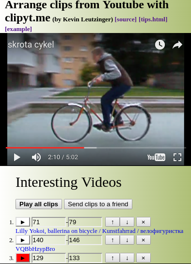

# Projects by Kevin Leutzinger [[My Github]](https://github.com/kleutzinger/)  
I enjoy making websites and tools that do useful things. Everything listed is made from scratch by me.
***  

### Chrome Extensions

| **Link**        | **Title**           |  **Description** |
| :-------------: |:----------------------:| :-----|
| <a href="https://chrome.google.com/webstore/detail/better-challonge-results/nlmopkefkemlpdpfkgllbeifljhkfeno"></img></a>      | Better Challonge Results       | Adds useful information (wins, losses, seeding) to the bracket results display on [challonge.com](http://challonge.com)  |
| <a href="https://chrome.google.com/webstore/detail/youtube-now-playing-descr/cclaiidhllljekopicenflhhkdkckkbl"></img></a>| Youtube Now Playing Description | Shows the currently playing song of Youtube video song compilations from timestamps in the description |
| <a href="https://chrome.google.com/webstore/detail/hide-retweets/iehhaigbokpilpilegajanpckfgbegdm"></img></a>| Hide Retweets       |   Hide retweets on twitter by specified users |
| <a href="https://chrome.google.com/webstore/detail/netflix-timestamp-link/nfamdnmnodndjpnfnlebmconoildihib"></img></a>      | Netflix Timestamp Link        | Send Netflix links at a specified time in the video   |
| <a href="https://chrome.google.com/webstore/detail/youtube-disable-keyboard/aahkpmpmpjbmjaanknmnamdbodbgdape"></img></a>      | Disable Youtube Keyboard Shortcuts        | Prevents keyboard controls on videos   |
| <a href="https://chrome.google.com/webstore/detail/full-size-instagram-right/lkkiifjajjichjecgefjlefgidpihnpp"></img></a>      | Full Size Instagram Right Click       | Easily see full size IG pictures  |
<br>

***

### ClipYT.me [2017]  
[clipyt.me](http://clipyt.me/#VQBbHzypBro+71+79+VQBbHzypBro+140+146+pZwvLFhYUL0+129+133+hGY44DIQb-A+81+92+MdcuaeYV9oM+164+177+IydCCUfPDLE+11+34+Interesting_Videos)  
A website that creates shareable compilations of multiple parts of youtube videos. It lets you combine or compare specific sections of many videos which then play in sequence when shared.  
Technologies used: HTML/JS/CSS, Youtube Embedded Player API  
[[source]](https://github.com/kleutzinger/clipyt.me)  
  

***

### Better Challonge Results  [2017]
https://chrome.google.com/webstore/detail/better-challonge-results/nlmopkefkemlpdpfkgllbeifljhkfeno  
https://addons.mozilla.org/en-US/firefox/addon/better-challonge-results/  
A Chrome and Firefox extension that improves and adds features to the results screen on challonge.com brackets. It adds displays for the wins/losses of every player, seeding, upsets, and more. Very useful for tournaments.  
Technologies used: HTML/JS/CSS, Chrome Extension, Firefox Extension    
[[source]](https://github.com/kleutzinger/better-challonge)  
  

***  

### Full Size Instagram Right Click  [2017]
https://chrome.google.com/webstore/detail/full-size-instagram-right/lkkiifjajjichjecgefjlefgidpihnpp  
A Chrome extension that allows you to right click on an Instagram picture to see and save it at full resolution.
Technologies used: HTML/JS/, Chrome Extension  
[[source]](https://github.com/kleutzinger/instagram-fullsize)  
  

***  

### Survive Simon's Rock College Game  
http://www.kevinleutzinger.com/surviveSRC/  
An avoider game featuring every student's face from my old school Simon's Rock. Dodge the faces and try to make it to the end of the song.  
Technologies used: HTML/JS, Firebase, Facebook API  
[[source]](https://github.com/kleutzinger/kleutzinger.github.io/tree/master/surviveSRC)  


***

### Planetary Motion Simulator  
http://www.kevinleutzinger.com/projects/final/  
Set the initial conditions for the star, planet, and moon to see how they behave.  
Technologies used: HTML/JS  
[[source]](https://github.com/kleutzinger/kleutzinger.github.io/tree/master/projects/final)
(made with Aaron Santiago)  
  

***

### Hearthstone Card Sound Identification Game  
http://www.kevinleutzinger.com/hearth
Play the sounds and try to guess the card name.  
Technologies used: HTML/JS  
[[source]](https://github.com/kleutzinger/kleutzinger.github.io/tree/master/hearth)  
  

***

### kevinleutzinger.com Homepage  
http://www.kevinleutzinger.com/  
Click refresh to get a new background.  
Technologies used: HTML/CSS/JS, D3.js  
[[source]](https://github.com/kleutzinger/kleutzinger.github.io/blob/master/index.html)  
  

***

### This Project Page  
Technologies used: HTML/CSS  

***

### Hosting Multiple Websites and Domains  
I set up a remote server from scratch to host multiple websites such as http://davismelee.club, http://kevbot.xyz:3000  
Technologies used: Lighttpd, Nodejs, VPS, Custom Domains

***

### Python Game of Life One-Liner
```python
def life(board):
  return [[int(int(sum(board[(y+y_d)%len(board)][(x+x_d)%len(board[0])] for y_d in range(-1,2) for x_d in range(-1,2)))+val*9 in (3,12,13)) for x, val  in enumerate(row)] for y, row in enumerate(board)]```


[Read about the game of life here](https://en.wikipedia.org/wiki/Conway%27s_Game_of_Life)  

***

### Quick Attack: A Kevbot Fox SSBM Combo Video
[Youtube link](https://www.youtube.com/watch?v=1WCsfcQgjk8)
